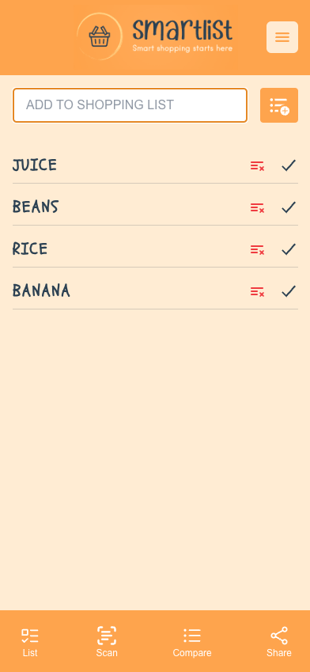

# SmartList - Your Intelligent Shopping Companion

[](https://www.smart-list.co.uk/)

## About

SmartList is a Progressive Web App (PWA) designed to revolutionize your grocery shopping experience. It empowers you to create and manage shopping lists effortlessly, compare prices from various stores to find the best deals, and access your lists even when offline. With its intuitive interface and powerful features, SmartList ensures you shop smarter and save money.

**Key Features:**

* **Effortless List Creation:** Easily create and manage shopping lists to keep track of items you need to buy.
* **Product Addition:** Add new products to your shopping list with ease.
* **Price Comparison:** Compare prices of products from different stores to find the best deals.
* **Lowest Price View:** See the lowest price for each product on your list and the store where it was found.
* **Offline Access:** Access your shopping lists and price comparisons even without an internet connection.
* **Installable PWA:** Install the app on your home screen for quick and easy access.

**Screenshots:**



*The main screen of SmartList, showcasing the shopping list with added items.*

**[Link to SmartList Website](https://www.smart-list.co.uk/)**

## User Stories

* As a user, I want to be able to create a shopping list, so that I can keep track of the items I need to buy.
* As a user, I want to be able to add new products to my shopping list, so that I can include all the items I need.
* As a user, I want to be able to view my current shopping list, so that I can easily see what I need to buy.
* As a user, I want to be able to compare prices of products from different stores, so that I can find the best deals.
* As a user, I want to be able to add new price information for products, so that the price comparison feature can be kept up-to-date.
* As a user, I want to be able to view the lowest price for each product on my shopping list, so that I can make informed purchasing decisions.
* As a user, I want to be able to view the store where the lowest price for each product was found, so that I know where to go to get the best deals.
* As a user, I want to be able to use the app offline, so that I can access my shopping list and price comparisons even when I don't have an internet connection.
* As a user, I want to be able to install the app on my home screen, so that I can easily access it from my device.

## Technical Tasks

* Set up the React project
* Create components for the shopping list, product form, price comparison, and navigation
* Implement API calls to interact with the backend
* Develop the price extraction and comparison logic
* Implement PWA features (service worker, manifest file)
* Write unit and integration tests
* Design and implement the user interface
* Address any bugs or issues

## Additional Considerations

* Data privacy and security
* Scalability of the backend
* User experience and accessibility
* Testing and quality assurance

## Getting Started

1.  **Visit the Website:** Go to [https://www.smart-list.co.uk/](https://www.smart-list.co.uk/) on your device's browser.
2.  **Add to Home Screen:** Follow the prompts to install the PWA on your home screen.
3.  **Create an Account (Optional):** Sign up for an account to save your lists and preferences.
4.  **Start Shopping:** Begin adding items to your shopping list and exploring the price comparison features.

## Contributing

We welcome contributions from the community! If you'd like to contribute to SmartList, please follow these steps:

1.  Fork the repository.
2.  Create a new branch for your feature or bug fix.
3.  Make your changes and commit them.
4.  Push your changes to your fork.
5.  Submit a pull request.

## License

This project is licensed under the [MIT License](LICENSE).

## Contact

For any questions or feedback, please contact us at [support@smart-list.co.uk](mailto:support@smart-list.co.uk).

---

**Note:** Please replace `https://i.imgur.com/your_image_link_here.png` with the actual links to your screenshot images. You can upload the images to Imgur or any other image hosting service and use the direct image links here.

This is a [Next.js](https://nextjs.org) project bootstrapped with [`create-next-app`](https://nextjs.org/docs/app/api-reference/cli/create-next-app).

## Getting Started

First, run the development server:

```bash
npm run dev
# or
yarn dev
# or
pnpm dev
# or
bun dev
```

Open [http://localhost:3000](http://localhost:3000) with your browser to see the result.

You can start editing the page by modifying `app/page.tsx`. The page auto-updates as you edit the file.

This project uses [`next/font`](https://nextjs.org/docs/app/building-your-application/optimizing/fonts) to automatically optimize and load [Geist](https://vercel.com/font), a new font family for Vercel.

## Learn More

To learn more about Next.js, take a look at the following resources:

- [Next.js Documentation](https://nextjs.org/docs) - learn about Next.js features and API.
- [Learn Next.js](https://nextjs.org/learn) - an interactive Next.js tutorial.

You can check out [the Next.js GitHub repository](https://github.com/vercel/next.js) - your feedback and contributions are welcome!

## Shopping List PWA with Price Comparison

User Stories
- As a user,I want to be able to create a shopping list,so that I can keep track of the items I need to buy.
- As a user,I want to be able to add new products to my shopping list,so that I can include all the items I need.
- As a user,I want to be able to view my current shopping list,so that I can easily see what I need to buy.
- As a user,I want to be able to compare prices of products from different stores,so that I can find the best deals.
- As a user,I want to be able to add new price information for products,so that the price comparison feature can be kept up-to-date.
- As a user,I want to be able to view the lowest price for each product on my shopping list,so that I can make informed purchasing decisions.
- As a user,I want to be able to view the store where the lowest price for each product was found,so that I know where to go to get the best deals.
- As a user,I want to be able to use the app offline,so that I can access my shopping list and price comparisons even when I don't have an internet connection.
- As a user,I want to be able to install the app on my home screen,so that I can easily access it from my device.
  
## Technical Tasks:
Set up the React project
Create components for the shopping list, product form, price comparison, and navigation
Implement API calls to interact with the backend
Develop the price extraction and comparison logic
Implement PWA features (service worker, manifest file)
Write unit and integration tests
Design and implement the user interface
Address any bugs or issues
Additional Considerations
Data privacy and security
Scalability of the backend
User experience and accessibility
Testing and quality assurance
This breakdown provides a clear structure for the development of the Shopping List PWA with Price Comparison. Feel free to adapt it based on your specific requirements and priorities.
